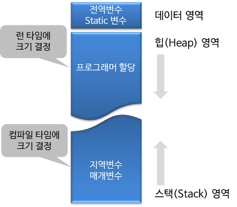
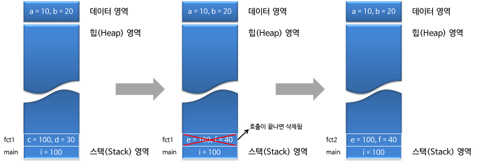

# 스택과 힙

> 스택 : 지역변수외 함수 변수를 저장하는 데 사용
>
> 힙 : 자바 객체를 저장하기 위해 사용

<br/>

* 프로그램을 실행시키면 운영체제는 우리가 실행시킨 프로그램을 위해 메모리 공간을 할당해 준다.

<br/>

* 코드 세그먼트 : 컴파일된 프로그램이 저장되는 영역, 일반적으로 read-only 속성이다.
* 데이터 세그먼트 : 전역 변수 및 정적 변수가 저장되는 영역
* 힙 세그먼트 : 동적으로 할당된 변수가 할당되는 영역
* 스택 세그먼트 : 함수 매개 변수, 지역 변수 및 기타 함수 관련 정보가 저장되는 영역

<br/>

- 할당되는 메모리 공간은 크게 **데이터(Data), 힙(Heap), 스택(Stack)** 영역으로 나뉜다.
  - 할당 시기 : 프로그램이 실행될 때 마다
  - 할당 장소 : 메인 메모리(RAM)
  - 할당 용도 : 프로그램 실행 시 필요한 메모리 공간(지역변수, 전역변수 선언을 위해) 할당 
- Stack은 정적 메모리 구조를 가지고 Heap 영역은 동적 메모리 구조를 가진다
- <u>메모리의 할당되는 메커니즘 질문 나옴</u>




### 데이터 영역

* **전역 변수와 Static 변수**가 할당되는 영역
* 프로그램의 시작과 동시에 할당되고, 프로그램이 종료되어야 메모리에서 소멸된다.

```c++
#include <stdio.h>
 
int a = 10;   //데이터 영역에 할당
int b = 20;   //데이터 영역에 할당
 
int main()
{
. . .
 
return 0;
}
```

* 위 코드에서 int형 변수 a, b는 프로그램 실행 시 main 함수가 호출되기 전에 데이터 영역에 할당되고, 프로그램이 종료 될 때까지 메모리상에 존재한다.

→ 전역변수가 프로그램이 종료될 때까지 존재하는 이유

<br/>

### 스택

* 함수 호출 시 생성되는 **지역 변수와 매개 변수가 저장**되는 영역
* 메모리 크기가 정해져 있다 (정적 메모리 할당/*불변*)
  - int, boolean, double 등

* 메소드가 호출될 때 마다 각각의 스택프레임(그 메서드 만을 위한 공간)이 생성됨
* **메소드 수행(함수 호출)이 끝나면 프레임 별로 삭제(메모리할당 해제)됨**
* **장점**
  - 액세스가 매우 빠름
  - 변수를 명시적으로 할당, 해제 필요 없음
    - 힙과 비교했을 때 빠름
    - 힙은 스택의 주소를 이용하여 액세스함
    - 힙은 스택을 거쳐가야 하기 때문에 상대적으로 느리다.
* **단점**
  - 메모리 크기를 변경할 수 없다.(불변)


- 프로그램에서 함수는 다른 함수를 호출하고 그 결과를 자신을 호출한 함수에 반환해줌
- 스택구조로 함수의 호출이 차곡차곡 메모리에 쌓이고, 처리가 끝나면 메모리에서 해제됨
- 스택 구조를 활용해 함수의 지역 변수 메모리를 관리하면 메커니즘을 쉽게 구현 할 수 있기 때문에 스택 형태로 영역을 만들어 활용
- 스택영역 == 스택 세그먼트

```c++
#include <stdio.h>
 
void fct1(int);
void fct2(int);
 
int a = 10;         //데이터 영역에 할당
int b = 20;         //데이터 영역에 할당
 
int main()
{
   int i = 100;     //지역변수 i가 스택 영역에 할당
 
   fct1(i);
   fct2(i);
 
   return 0;
}
 
void fct1(int c)
{
   int d =30;        //매개변수 c와 지역변수 d가 스택 영역에 할당
}
//호출이 끝나면서 c와 d는 스택영역에서 삭제
 
 
void fct2(int e)
{
   int f = 40;       //매개변수 e와 지역변수 f가 스택 영역에 할당
}
//호출이 끝나면서 e과 f는 스택영역에서 삭제 
```



<br/>

### 힙

* 메모리 크기가 정해져 있지 않다 (동적 메모리 할당/*가변*)
  - String, Object, Array 등
* **장점**
  - 메모리 크기를 변경할 수 있다(효율적)
* **단점**
  - 상대적으로 느린 액세스

<br/>

- 필요에 의해 동적으로 메모리를 할당할 때 사용
- 관리 가능한 데이터 외에 다른 형태의 데이터를 관리하기 위한 빈 공간(Space)
- 동적할당(Dynamic Allocation)에 의해 생성된 동적 변수(Dynamic Variables)를 관리하기 위한 영역
- `new연산자`로 생성된 객체와 배열을 저장하는 공간
- 클래스 영역에 로드된 클래스만 생성가능
- **GarbageCollector를 통해 메모리가 반환(메모리할당 해제)됨**
- java나 c++등에서 'new', c에서 'malloc', 'calloc' 을 통해 동적으로 생성되는 변수를 저장하기 위해 할당 되는 영역
- 데이터 영역과 스택 영역은 컴파일러가 미리 공간을 예측하고 할당할 수 있지만 동적 변수는 어느 시점에 어느정도의 공간으로 할당될 지 정확하게 예측할 수 없기 때문에 프로그램 실행중(**Runtime** 시점)에 결정됨
- 힙 영역을 사용하기 위해서는 동적할당에 대해 알아야함

<br/>

### 스택 오버플로우

* 스택 세그먼트는 크기가 제한되어 있으므로 제한된 양의 데이터만 저장할 수 있다.
* window 운영체제에서 기본 스택 세그먼트의 크기는 1MB다.
* 응용 프로그램이 스택 세그먼트에 너무 많은 정보를 넣으려고 하면 **스택 오버플로(stack overflow)**가 발생
* 스택 오버플로(Stack overflow)는 스택 세그먼트의 모든 메모리가 할당되어 꽉 찼을 때 발생하며, 이 경우 추가 할당이 메모리의 다른 섹션으로 넘치기 시작한다.
* 스택 오버플로는 일반적으로 스택 세그먼트에 너무 많은 변수를 할당하거나 중첩된 함수 호출(A calls function B calls function C calls funct D...)을 너무 많이 한 결과다.
* 보통 스택 오버플로가 발생하면 프로그램이 다운된다.

↔ **힙 오버플로우** : heap이 주소값을 채워져 오다가 Stack 영역을 침범하는 경우

<br/>

------

[참고 자료]

https://ooz.co.kr/244

https://opennote46.tistory.com/67

https://boycoding.tistory.com/235